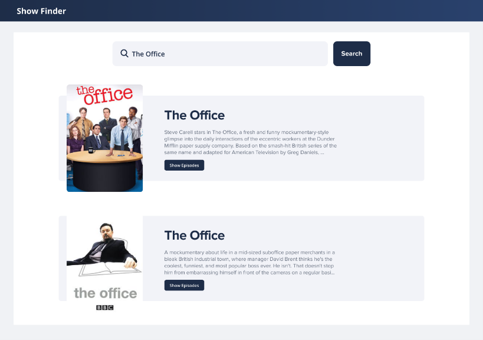
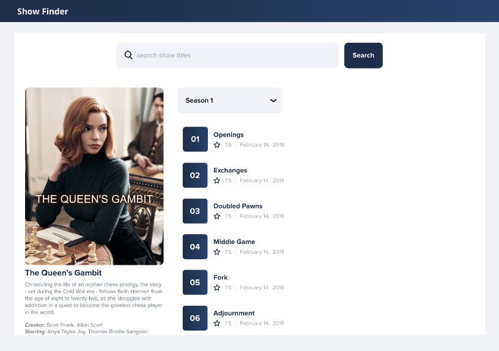

## TV Listings
Using an npm starter application such as “create-react-app”

Create an interface that has an input that will search the TV Maze API

[TVmaze API](http://www.tvmaze.com/api)

[TVmaze API Example - https://api.tvmaze.com/search/shows?q=walking](https://api.tvmaze.com/search/shows?q=walking)

Then, display the results matching the design provided.

Success is:
- The initial page will have a text input and button.
- Successfully make the api call
- Display the results in a view that is human readable.

Extra:
If time allows feel free to add anything additional that you would like to highlight.
For example:
- Tests
- Interactions to click a show and get a list of episodes

[TVmaze](https://tvmaze.com)

Add television information to your own website or app with a fast and clean TV API. Add schedules, show, episode, cast information, 

