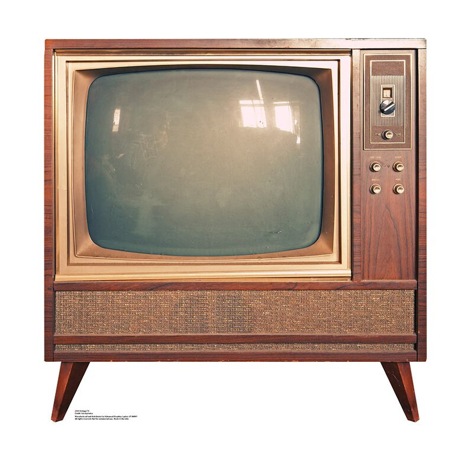

# TV Junkies

## Purpose
                
This is an app I created to demonstrate the use of:

- React
- React Router
- React Hooks
- Local state management with the React Hook API
- Accessing URL parameters
- Responsive CSS Grid
- Modular Sass
- JavaScript Fetch API with async/await
- Helmet to inject meta into the &lt;head&gt;

## Contact

To view other demo projects, visit my online [portfolio](https://brentdanley.codes/portfolio).  

If you'd like to hire me to be an integral part of your team, have a look at my [resume](https://brentdanley.codes/resume/), then contact me at (207) 423-7145 or send an email to [brentdanley@gmail.com](mailto:brentdanley@gmail.com).
